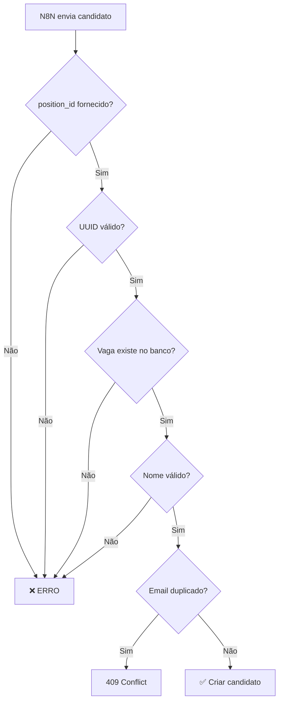

# Sistema de Validação de Candidatos

## ⚠️ CRÍTICO: Integridade de Dados

Este documento descreve as validações implementadas para **PREVENIR ERROS** de candidatos vinculados a vagas inválidas.

## Problema Resolvido

Anteriormente, candidatos eram criados com `position_id` inválidos (strings em vez de UUIDs), causando:
- Candidatos não aparecendo nas vagas específicas
- Dados inconsistentes no banco
- Erros ao tentar filtrar por vaga

## Validações Implementadas

### 1. **Banco de Dados (Migration)**
✅ Foreign Key Constraint adicionada:
```sql
ALTER TABLE candidates
ADD CONSTRAINT fk_candidates_position
FOREIGN KEY (position_id) 
REFERENCES job_positions(id) 
ON DELETE SET NULL;
```

Isso garante que **NENHUM** candidato pode ser criado com um `position_id` que não existe.

### 2. **Edge Function: receive-n8n-analysis**

Validações em ordem:
1. ✅ Verifica se `position_id` foi fornecido
2. ✅ Valida formato UUID do `position_id`
3. ✅ Consulta banco para verificar se a vaga existe
4. ✅ Valida nome do candidato não vazio
5. ✅ Sanitiza email e telefone

**Exemplo de erro capturado:**
```
❌ ERRO CRÍTICO: Vaga não encontrada no banco: gerente_de_contas_b2b_703662
```

### 3. **Frontend: NewCandidateModal**

Validações antes de enviar:
1. ✅ Verifica se vaga foi selecionada
2. ✅ Verifica se vaga existe na lista
3. ✅ Verifica se vaga tem `endpoint_id` configurado

### 4. **Frontend: useBulkResumeUpload**

Validações para uploads em massa:
1. ✅ Valida UUID ou endpoint_id
2. ✅ Busca vaga no banco antes de processar
3. ✅ Verifica se `endpoint_id` está configurado

## Mapeamento de Posições (N8N → Supabase)

O arquivo `receive-n8n-analysis/index.ts` contém um **mapeamento estático**:

```typescript
const positionMapping: { [key: string]: string } = {
  'vendedor_001': '4b941ff1-0efc-4c43-a654-f37ed43286d3',
  'analista_de_seo_079246': 'a7e9ba85-9792-467e-ad9a-06b8f3b91e17',
  // ... outros mapeamentos
};
```

### ⚠️ IMPORTANTE: Ao criar nova vaga

Quando criar uma nova vaga no sistema:

1. **Cadastre a vaga** no sistema através da interface
2. **Anote o UUID** gerado pela vaga
3. **Configure o endpoint_id** na vaga (ex: "vendedor_002")
4. **Atualize o mapeamento** em `receive-n8n-analysis/index.ts`:
   ```typescript
   'vendedor_002': 'UUID-DA-NOVA-VAGA',
   ```

## Fluxo de Criação de Candidato



## Checklist para Novos Desenvolvedores

Ao trabalhar com candidatos, **SEMPRE**:

- [ ] Valide o `position_id` como UUID
- [ ] Verifique se a vaga existe no banco antes de criar candidato
- [ ] Sanitize inputs (trim, lowercase para emails)
- [ ] Use `.maybeSingle()` ao buscar vagas (não `.single()`)
- [ ] Adicione logs detalhados para debug
- [ ] Teste com vagas que não existem para verificar tratamento de erro

## Logs de Debug

Todos os pontos críticos têm logs:
- 🔍 = Validação em progresso
- ✅ = Validação bem-sucedida
- ❌ = Erro detectado

Exemplo:
```
🔍 [VALIDAÇÃO] Resolvendo vaga. Valor: vendedor_001 (é UUID? false)
✅ [VALIDAÇÃO] Vaga encontrada: { id: "4b941ff1...", title: "Vendedor" }
```

## Testes Recomendados

Antes de fazer deploy:
1. ✅ Criar candidato com vaga válida
2. ✅ Tentar criar candidato sem vaga (deve falhar)
3. ✅ Tentar criar candidato com UUID inválido (deve falhar)
4. ✅ Tentar criar candidato com vaga inexistente (deve falhar)
5. ✅ Criar candidato duplicado (deve retornar 409)

## Contato

Em caso de erros relacionados a candidatos inválidos, verifique:
1. Logs da edge function `receive-n8n-analysis`
2. Foreign key constraint no banco
3. Mapeamento de posições atualizado
